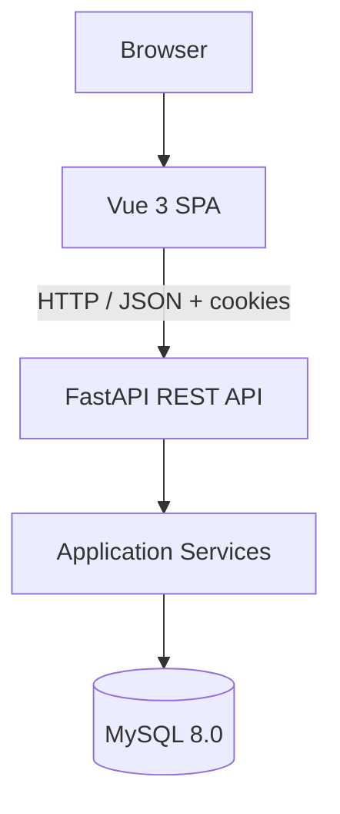

# Dicto

<div align="center">
  
  **Spanish grammar and vocabulary, made clear**

  Dicto is a full-stack web app for learning Spanish through spaced repetition.

  [](https://fastapi.tiangolo.com/)
  [](https://vuejs.org/)
  [](https://www.mysql.com/)
  [](https://www.docker.com/)
</div>

---

## Table of Contents

- [Dicto](#dicto)
  - [Table of Contents](#table-of-contents)
  - [Features](#features)
  - [Architecture](#architecture)
  - [Tech Stack](#tech-stack)
  - [Getting Started](#getting-started)
    - [Prerequisites](#prerequisites)
    - [Local Development with Docker](#local-development-with-docker)
    - [Local Development Without Docker](#local-development-without-docker)
      - [Backend](#backend)
      - [Frontend](#frontend)
    - [Seeding Content](#seeding-content)
    - [Development Sample Data](#development-sample-data)
  - [Testing](#testing)
  - [Project Structure](#project-structure)
  - [Deployment](#deployment)
  - [Security Notes](#security-notes)
  - [Notes](#notes)

---

## Features

- Spanish grammar and vocabulary learning through spaced repetition
- Review sessions with cloze-style prompts and server-side answer validation
- Learning queue management for new grammar points and vocabulary items
- Study pages for grammar explanations, examples, and vocabulary details
- Dashboard statistics and mastery views
- Cookie-based authentication with login, logout, and Google sign-in support
- Admin-oriented content management endpoints
- Dockerized local development with MySQL, API, and frontend services

## Architecture

Dicto uses a modular monolith architecture:

- A Vue 3 single-page application handles the UI.
- A FastAPI backend exposes the REST API and application logic.
- A MySQL database stores users, sessions, learning state, prompts, and review logs.



The backend is organized around routers, services, ORM models, and Alembic migrations. The frontend uses Vue Router and small reactive composables for shared state such as auth and queue counts.

For a deeper breakdown of the system design, see [docs/architecture.md](docs/architecture.md).
For entity relationships and the full data model, see [docs/class-diagram.md](docs/class-diagram.md).

## Tech Stack

**Backend**

- Python 3.12+
- FastAPI
- SQLAlchemy 2.x
- Alembic
- PyMySQL
- Google Auth for Google sign-in verification

**Frontend**

- Vue 3
- Vue Router
- Vite
- Vitest
- Playwright

**Infrastructure**

- Docker / Docker Compose
- MySQL 8.0

## Getting Started

### Prerequisites

- Docker and Docker Compose
- Node.js 25+ if you want to run the frontend outside Docker
- Python 3.12+ if you want to run the backend outside Docker

### Local Development with Docker

1. Copy the sample environment file:

```bash
cp .env.example .env
```

1. Start the full stack:

```bash
docker-compose up --build
```

1. Open the app:

- Frontend: <http://localhost:5173>
- API: <http://localhost:8000>
- API health check: <http://localhost:8000/api/health>

The backend applies Alembic migrations on startup and ensures the default users exist.

### Local Development Without Docker

#### Backend

```bash
cd backend
pip install -r requirements.txt
uvicorn app.main:app --reload --port 8000
```

#### Frontend

```bash
cd frontend
npm install
npm run dev -- --port 5173
```

### Seeding Content

To populate the database with the initial learning content:

```bash
make seed
```

Or run the script directly from the backend container:

```bash
python scripts/seed.py
```

### Development Sample Data

To fill the default test user with realistic dashboard/review data while running the local Docker development environment:

```bash
make dev-sample-data
```

This target runs pending migrations, ensures the default users and real learning content exist, then loads sample data for `DEFAULT_USER_EMAIL` only. It resets that user's existing review states and review logs, then creates:

- review items across multiple mastery levels
- due/pending reviews
- real scheduled review items in the forecast
- past review activity for the activity chart
- daily learning preferences so projected forecast items appear

The script is guarded for local development: it requires `DICTO_DEV_SAMPLE_DATA=1` and refuses non-local database hosts. To use a different local timezone for the generated activity/forecast dates:

```bash
make dev-sample-data sample_tz=Europe/Madrid
```

## Testing

Backend tests:

```bash
make test
```

Backend coverage:

```bash
make test-cov
```

End-to-end tests:

```bash
make e2e
```

Frontend unit tests:

```bash
make test-frontend
```

## Project Structure

```text
dicto/
├── backend/
│   ├── app/
│   │   ├── core/        # configuration and security helpers
│   │   ├── db/          # SQLAlchemy engine and session setup
│   │   ├── models/      # ORM models
│   │   ├── routers/     # API endpoints
│   │   ├── schemas/     # request/response schemas
│   │   └── services/    # application logic
│   ├── alembic/         # database migrations
│   ├── scripts/         # seed and utility scripts
│   └── tests/           # backend tests
├── docs/                # architecture and class diagrams
├── frontend/
│   ├── src/             # Vue app source code
│   └── e2e/             # Playwright tests
├── docker-compose.yml
├── render.yaml
└── .env.example
```

## Deployment

Dicto is designed to run locally with Docker Compose and can also be deployed with Render using the supplied [render.yaml](render.yaml).

Key environment variables:

- `DATABASE_URL` or the `MYSQL_*` / `DB_HOST` / `DB_PORT` settings from [.env.example](.env.example)
- `API_CORS_ORIGIN`
- `VITE_API_BASE_URL`
- `SESSION_COOKIE_SECURE`
- `SESSION_COOKIE_SAMESITE`
- `GOOGLE_CLIENT_ID`
- `DEFAULT_USER_PASSWORD`
- `DEFAULT_ADMIN_PASSWORD`

The Render blueprint is configured for:

- a Docker-based API service
- a static frontend site
- an external MySQL database

## Security Notes

- Authentication uses server-side sessions stored in MySQL and sent to the browser as HttpOnly cookies.
- Passwords are hashed server-side.
- Review answers are validated on the backend, not in the browser.
- For production, use HTTPS and set cookie security flags appropriately.
- Keep `.env` out of version control.

## Notes

- Default users are created automatically on startup if they do not already exist.
