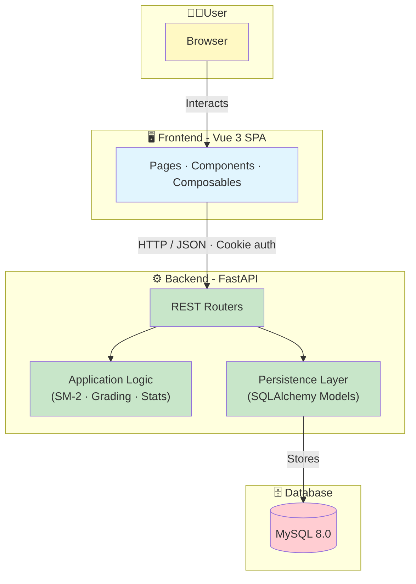
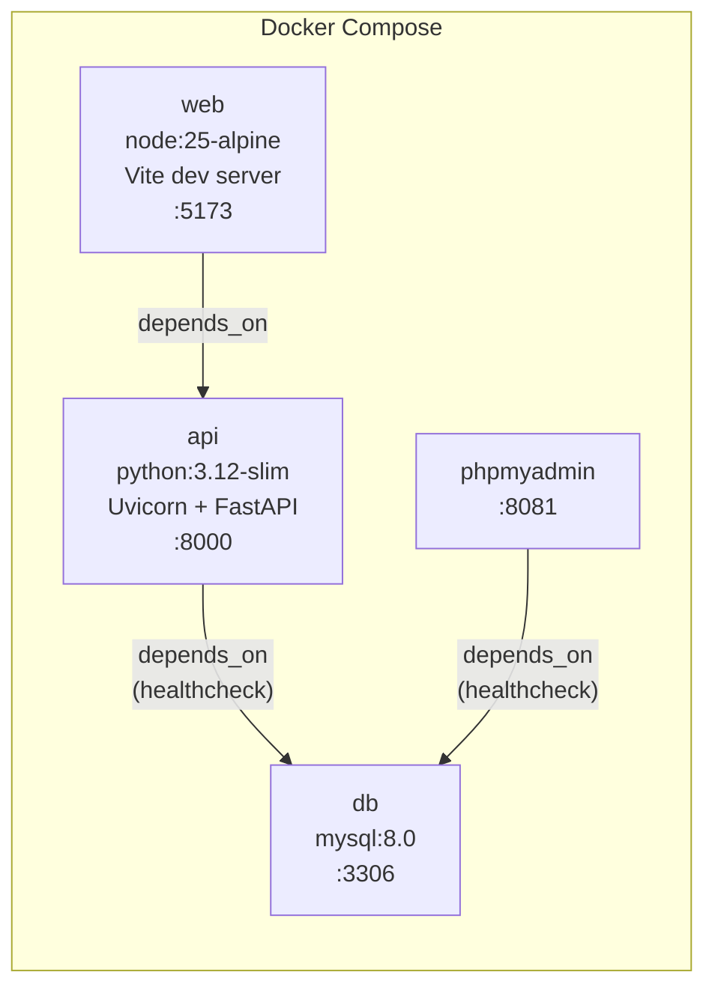
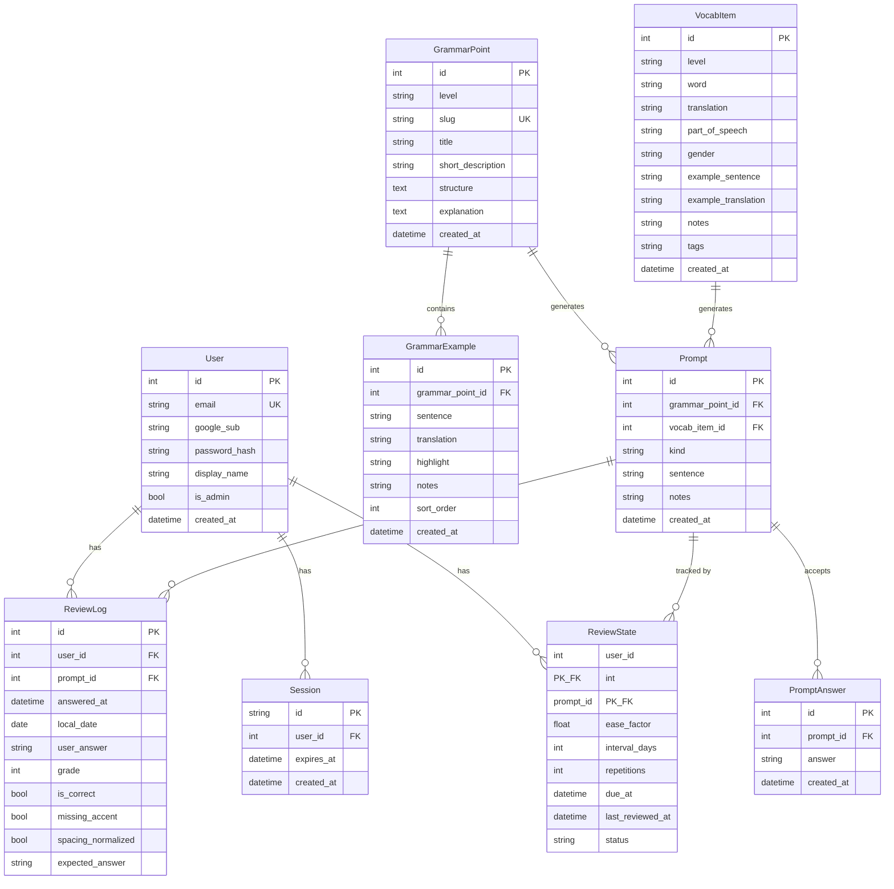
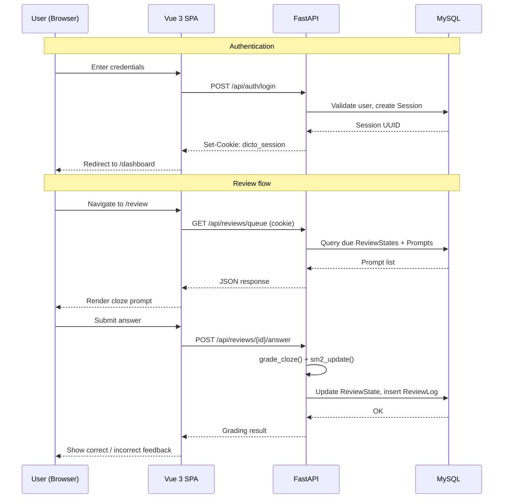

# Project Architecture

Dicto (dicto.es) is a full-stack web application for learning Spanish vocabulary and grammar through spaced repetition. The system follows a client–server architecture composed of a Vue 3 single-page application (SPA) that consumes a FastAPI REST API, backed by a MySQL relational database. All services are containerized and orchestrated with Docker Compose, which makes the development environment reproducible and simplifies deployment.

Given the scope of the project and its academic context, a modular monolithic approach was chosen over a microservices architecture. The application does not require independent deployment per service, distributed data ownership, or horizontal scaling across multiple independently evolving components. A single backend API and a single frontend SPA reduce operational complexity while still allowing the codebase to remain organized through well-defined module boundaries.

## High-level components



The **frontend** is a Vue 3 SPA responsible for user interaction, navigation, and UI state. It provides the learner-facing flows—dashboard, learn, study, review, grammar and vocabulary catalog—as well as the admin interface used to manage content. The frontend communicates with the backend exclusively via JSON over HTTP and includes credentials on every request in order to support cookie-based authentication.

The **backend** is implemented with FastAPI and exposes a REST API that centralizes all application logic. This includes authentication, content retrieval and administration, learning queue preparation, spaced repetition review scheduling, and dashboard statistics generation. The backend also implements the core grading behavior for cloze prompts, including input normalization and accent-aware comparison.

The **database** uses MySQL 8.0 (InnoDB) to persist user accounts, sessions, content entities (grammar points, vocabulary items, prompts and their accepted answers), learning state (SM-2 parameters per user–prompt pair), and review history. The relational model enforces referential integrity through foreign key constraints, which is especially relevant in admin operations where content may be created, modified, or removed.

## Deployment and runtime setup

The system is deployed as a set of Docker containers orchestrated through Docker Compose. The main services are:

| Service        | Base Image          | Port | Role                                            |
|----------------|---------------------|------|-------------------------------------------------|
| **web**        | `node:25-alpine`    | 5173 | Vue 3 SPA served by the Vite development server |
| **api**        | `python:3.12-slim`  | 8000 | FastAPI application served by Uvicorn           |
| **db**         | `mysql:8.0`         | 3306 | Relational database (InnoDB, utf8mb4)           |
| **phpmyadmin** | `phpmyadmin:latest` | 8081 | Database inspection tool (development only)     |



Hot-reload is enabled for both the frontend (`src/` volume mount) and the backend (`app/` volume mount) during development. The API service waits for the database to pass its health check before starting. On startup, the backend automatically applies pending Alembic migrations and ensures that default user accounts exist. This setup enables a consistent local environment with minimal manual configuration.

## Backend module organization

Although the backend is deployed as a single service, it is organized internally by responsibility. The structure separates routing (HTTP endpoint definitions) from persistence (database models and session handling) and from reusable domain logic such as grading, SM-2 scheduling, and mastery computation.

```bash
backend/
├── app/
│   ├── main.py            # App factory, lifespan, CORS, router mounting
│   ├── core/              # Config and security helpers (Argon2 password hashing)
│   ├── db/                # SQLAlchemy engine/session (database.py)
│   ├── models/            # ORM models package (9 tables)
│   ├── schemas/           # Pydantic request/response schemas package
│   ├── dependencies.py    # FastAPI dependencies (auth guards, DB session)
│   ├── internal/          # Internal/admin router module
│   ├── utils.py           # Grading, SM-2 scheduling, mastery helpers
│   └── routers/
│       ├── auth.py        # Authentication endpoints
│       ├── grammar.py     # Grammar points (user-facing, read-only)
│       ├── vocab.py       # Vocabulary items (user-facing, read-only)
│       ├── learn.py       # Learning queue management
│       ├── reviews.py     # Spaced repetition review cycle
│       └── stats.py       # Dashboard statistics
├── alembic/               # Version-controlled database migrations
├── scripts/seed.py        # Idempotent content seeder
└── tests/                 # Unit and integration tests
```

This modular organization improves maintainability and testability while keeping the system simple to deploy and reason about.

## Authentication model

Dicto uses cookie-based session authentication. After a successful login—either via email and password or via Google Sign-In—the backend creates a server-side session record with a configurable expiration (default: 14 days) and returns an `HttpOnly` session cookie to the client. Subsequent authenticated requests rely on this cookie, which the browser sends automatically.

This approach is well suited for a browser-based SPA: it supports server-side session invalidation, avoids exposing tokens to client-side JavaScript, and keeps the authentication flow straightforward. Two levels of authorization are enforced through FastAPI dependency injection: `get_current_user` validates the session and returns the user or a 401 response, and `get_admin_user` additionally verifies that the user has administrative privileges or returns 403.

## Data model

The relational schema consists of nine tables organized around three concerns: identity (users and sessions), content (grammar points, vocabulary items, prompts and accepted answers), and learning state (review state and review logs).



The `Prompt` entity acts as the bridge between content and the learning system. Each prompt belongs to either a grammar point or a vocabulary item (via nullable foreign keys) and carries one or more accepted answers. The `ReviewState` table holds the per-user SM-2 scheduling parameters for each prompt (composite primary key on `user_id` and `prompt_id`), while `ReviewLog` provides an append-only audit trail of every answer submitted.

## Frontend architecture

The frontend is built with Vue 3 using the Composition API and `<script setup>` syntax. It is bundled by Vite and uses Vue Router for client-side navigation with HTML5 history mode.

```bash
frontend/src/
├── main.js                # App bootstrap
├── App.vue                # Root layout (navbar, content, footer)
├── router.js              # Route definitions + navigation guards
├── api.js                 # Centralized API client (apiFetch)
├── auth.js                # useAuth composable
├── counts.js              # useCounts composable
├── theme.js               # useTheme composable
├── components/            # Reusable UI components
│   ├── AppNavBar.vue
│   ├── AppFooter.vue
│   ├── MasteryProgress.vue
│   ├── badges/            # LevelBadge, TypeBadge
│   └── charts/            # ForecastChart, ActivityChart
└── pages/                 # Route-level views
    ├── Home.vue, Login.vue, Dashboard.vue
    ├── Learn.vue, Study.vue, Review.vue
    ├── GrammarList.vue, GrammarDetail.vue
    ├── VocabList.vue, VocabDetail.vue
    └── admin/             # AdminLayout, CRUD forms and lists
```

Instead of a centralized store such as Vuex or Pinia, the application manages shared state through **reactive composables**—singleton reactive objects created at module scope and consumed by any component that imports them. Three composables cover the application's cross-cutting state: `useAuth` (user identity and login/logout actions), `useCounts` (review and learn queue counts for the navigation bar), and `useTheme` (light/dark mode toggle with `localStorage` persistence).

All HTTP communication passes through a single `apiFetch()` function that wraps the native `fetch` API. It prepends the configurable base URL, sets `credentials: "include"` for cookie transmission, attaches JSON headers, and propagates structured errors. This thin abstraction keeps API calls consistent across all pages without introducing a heavier HTTP client library.

The UI is styled with plain CSS and CSS custom properties. A theming system supports light and dark modes by toggling a `data-theme` attribute on the document root, with all colors defined as CSS variables. No CSS preprocessor or utility framework is used.

## Data flow



A typical interaction follows the same pattern across all features. The user triggers an action in the SPA, which issues an HTTP request to the FastAPI backend. The backend validates the request, queries or updates the database, applies the corresponding business logic—for example, grading a cloze answer and recalculating SM-2 scheduling parameters—and returns a JSON response. The frontend then updates the UI accordingly.

This pattern is especially important in the review flow, where the scheduling update must be applied atomically: the `ReviewState` row is updated and a `ReviewLog` entry is inserted within the same database session, preventing inconsistencies between the review history and the current scheduling state.

## Architectural rationale

The chosen architecture prioritizes clarity and correctness. A client–server design with a modular monolithic backend provides an appropriate balance between simplicity and structure for the scope of the project. The separation between frontend presentation, backend API logic, and relational persistence supports future extensions—such as additional exercise types, richer progress reporting, or more advanced analytics—without increasing deployment complexity.

| Decision                                 | Rationale                                                                                                                                       |
|------------------------------------------|-------------------------------------------------------------------------------------------------------------------------------------------------|
| **Cookie-based sessions** over JWT       | HttpOnly cookies are immune to XSS token theft; server-side sessions allow immediate invalidation; simpler model for a browser-only client.     |
| **SM-2 algorithm**                       | Well-established spaced repetition algorithm with a proven track record; simple to implement, tune, and explain.                                |
| **Monorepo with Docker Compose**         | All services start with a single command; volume mounts enable hot-reload; consistent environment across machines.                              |
| **Modular monolith** over microservices  | No need for independent scaling or deployment; reduces operational overhead while maintaining clean internal boundaries.                        |
| **Reactive composables** over Vuex/Pinia | Application state is small enough that Vue's built-in reactivity suffices; avoids an additional dependency and boilerplate.                     |
| **Plain CSS with custom properties**     | Eliminates build-time CSS dependencies; CSS variables enable theming with zero runtime JavaScript overhead.                                     |
| **Cloze-deletion with accent tolerance** | Tests active recall, which is more effective than recognition; accent-aware grading avoids penalizing learners for minor diacritical omissions. |
| **Alembic migrations**                   | Enables version-controlled, incremental schema evolution with rollback support.                                                                 |
