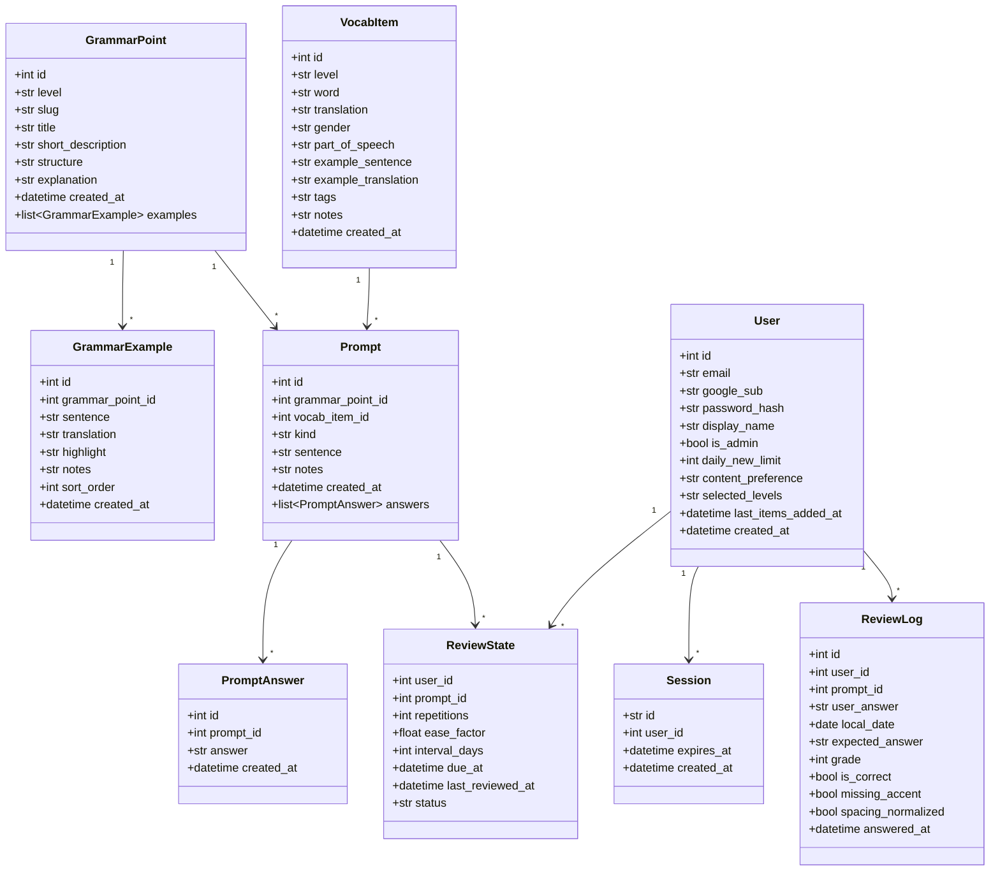

# Class Diagram

```mermaid
---
config:
  layout: dagre
---
classDiagram
direction TB
    class GrammarPoint {
    +int id
    +str level
    +str slug
    +str title
    +str short_description
    +str structure
    +str explanation
    +datetime created_at
    +list~GrammarExample~ examples
    }

    class GrammarExample {
    +int id
    +int grammar_point_id
    +str sentence
    +str translation
    +str highlight
    +str notes
    +int sort_order
    +datetime created_at
    }

    class User {
    +int id
    +str email
    +str google_sub
    +str password_hash
    +str display_name
    +bool is_admin
    +int daily_new_limit
    +str content_preference
    +str selected_levels
    +datetime last_items_added_at
    +datetime created_at
    }

    class Session {
    +str id
    +int user_id
    +datetime expires_at
    +datetime created_at
    }

    class VocabItem {
    +int id
    +str level
    +str word
    +str translation
    +str gender
    +str part_of_speech
    +str example_sentence
    +str example_translation
    +str tags
    +str notes
    +datetime created_at
    }

    class Prompt {
    +int id
    +int grammar_point_id
    +int vocab_item_id
    +str kind
    +str sentence
    +str notes
    +datetime created_at
    +list~PromptAnswer~ answers
    }

    class PromptAnswer {
    +int id
    +int prompt_id
    +str answer
    +datetime created_at
    }

    class ReviewState {
    +int user_id
    +int prompt_id
    +int repetitions
    +float ease_factor
    +int interval_days
    +datetime due_at
    +datetime last_reviewed_at
    +str status
    }

    class ReviewLog {
    +int id
    +int user_id
    +int prompt_id
    +str user_answer
    +date local_date
    +str expected_answer
    +int grade
    +bool is_correct
    +bool missing_accent
    +bool spacing_normalized
    +datetime answered_at
    }

    GrammarPoint "1" --> "*" GrammarExample
    User "1" --> "*" Session : <br>
    Prompt "1" --> "*" PromptAnswer : <br>
    Prompt "1" --> "*" ReviewState : <br>
    GrammarPoint "1" --> "*" Prompt
    VocabItem "1" --> "*" Prompt : <br>
    User "1" --> "*" ReviewState : <br>
    User "1" --> "*" ReviewLog : </br>
```
